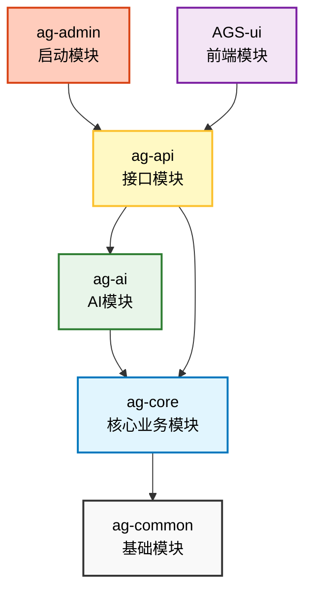

```text
  ______  ______
 /\  __ \/\  ___\
 \ \  __ \ \ \_— \
  \ \_\ \_\ \_____\
   \/_/\/_/\/_____/   Starter

 ::::::::::::::::::::::::::::::::::::::::::::::::::::

  :: AgentGuard Starter    ::   Spring Boot 3.5.12
  :: Profile               ::   default

  >>  Application started!  Agent is on guard.

 ::::::::::::::::::::::::::::::::::::::::::::::::::::
```

#### 页面效果
首页：


知识库：

权限管理：


#### 项目模块介绍

```text
agent-guard-starter/
├── ag-common/          # 基础模块
├── ag-core/            # 核心业务模块
├── ag-ai/              # AI 模块
├── ag-api/             # 接口模块
├── ag-admin/           # 启动模块
└── AGS-ui/             # 前端模块
    └── ags-frontend/   # 前端应用
```



#### 配置文件：

需要copy application-local-example.yaml为application-local.yaml

```text
/ag-admin/src/main/resources/application.yaml
```

#### 数据库脚本：

```text
/ag-admin/src/main/resources/db/migration
```

#### 接口文档：

```text
/ag-api/src/main/java/resources/API接口文档
```

#### commit规范

用于说明 commit 的类别，只允许使用下面这些标识：

| 类型       | 说明                                     |
|:---------|:---------------------------------------|
| feat     | 新功能                                    |
| fix      | 修补 bug                                 |
| docs     | 仅修改文档 (如 README, CHANGELOG)            |
| style    | 修改代码格式 (不影响代码运行的变动，如空格、分号、格式化)         |
| refactor | 重构 (即不是新增功能，也不是修改 bug 的代码变动)           |
| perf     | 优化相关，比如提升性能、体验                         |
| test     | 增加测试或修改现有的测试                           |
| chore    | 构建过程或辅助工具的变动 (如修改 .gitignore, pom.xml) |
| ci       | 修改 CI/CD 配置或脚本                         |
| revert   | 回滚到上一个版本                               |
| sql      | 修改数据库相关                                |
